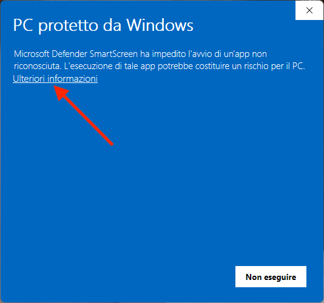
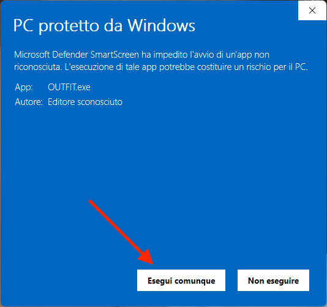
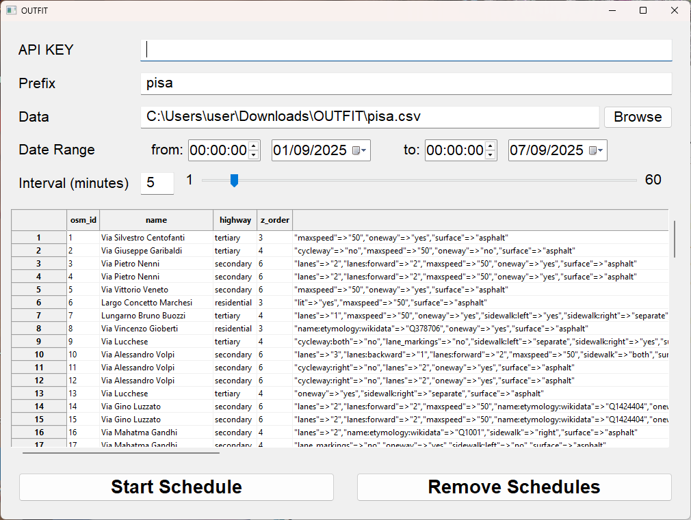
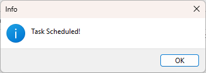
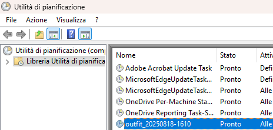

# How to Run OUTFIT.exe

**Repository:** [ParaGroup/OUTFIT](https://github.com/ParaGroup/OUTFIT)

## 1. Download & Extract
- Download [OUTFIT.zip](https://github.com/ParaGroup/OUTFIT/raw/refs/heads/main/OUTFIT.zip)
- Unzip the file

## 2. Prepare Data
- Get the `your_city.csv` file from the repo’s `data` folder (or your own GIS data)
- Place `your_city.csv` in the same folder as `OUTFIT.exe`

## 3. Run the App
- Open `OUTFIT.exe`
- If Windows blocks it:
  - Click **More Info**

		

  - Then click **Run Anyway**

  		

## 4. Fill Required Fields
- **API Key** → your Google API key
- **Prefix** → name to identify your dataset
- **Data** → path to `your_city.csv`
- **Date Range** → time span for data collection
- **Interval** → minutes between API calls

## 5. Start & Verify
- Click **Start Schedule** button → you’ll see *“Task Scheduled!”*

	

- Open **Task Scheduler Configuration Tool** (**Utilita' di Pianificazione**) to confirm the task has been created!

	(The task will be named with the prefix "**outfit_**", see the next image)

	